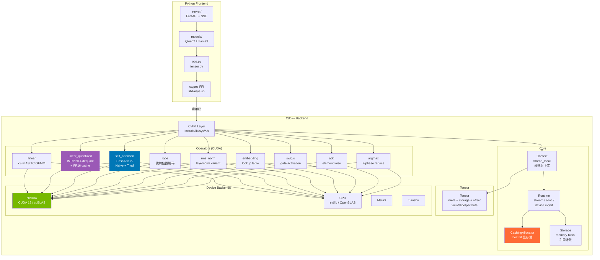
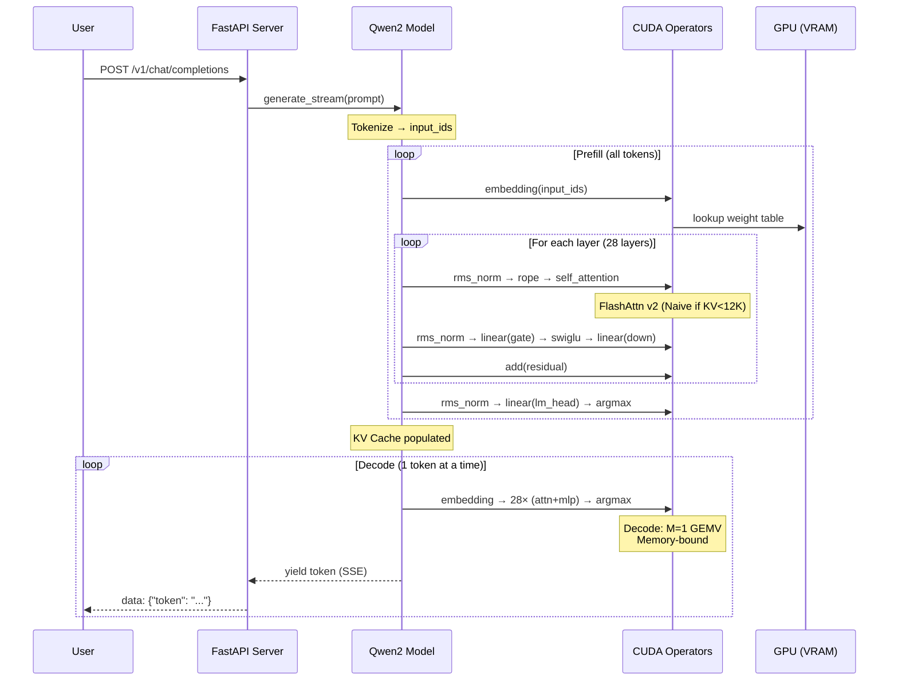
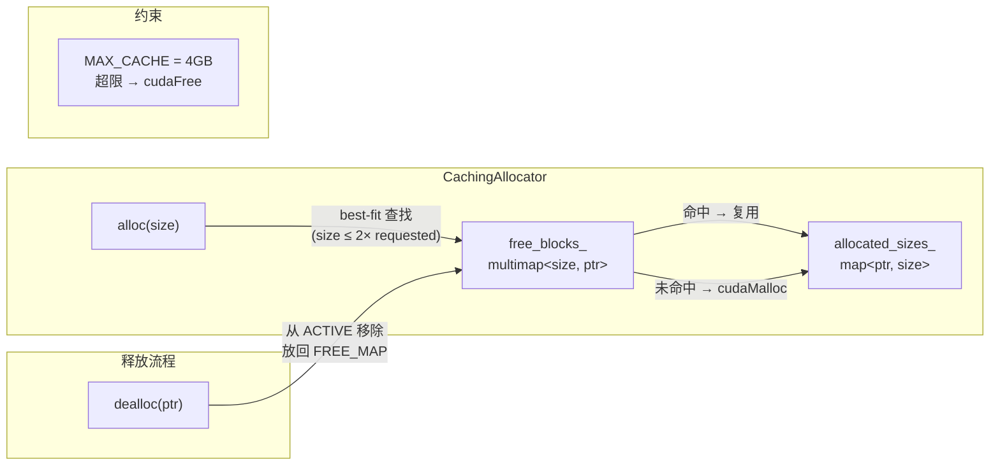
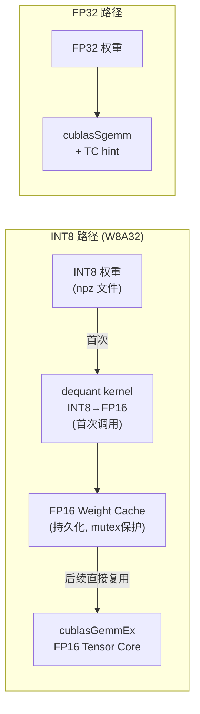

# LLAISYS 系统架构

## 整体架构图



## 推理数据流



## 内存管理流



## 量化推理路径



## 多设备抽象

```mermaid
classDiagram
    class LlaisysRuntimeAPI {
        <<C struct / 函数指针表>>
        +malloc_fn(size) void*
        +free_fn(ptr) void
        +memcpy_fn(dst, src, size, kind) void
        +memset_fn(dst, val, size) void
        +create_stream_fn() stream
        +sync_stream_fn(stream) void
    }
    
    class NvidiaRuntime {
        cudaMalloc / cudaFree
        cudaMemcpy
        cudaStreamCreate
    }
    
    class CpuRuntime {
        malloc / free
        memcpy / memset
        (no stream)
    }
    
    class Context {
        -thread_local device_type
        -thread_local device_id
        +setDevice(type, id)
        +getRuntime() LlaisysRuntimeAPI*
    }
    
    LlaisysRuntimeAPI <|.. NvidiaRuntime : 填充函数指针
    LlaisysRuntimeAPI <|.. CpuRuntime : 填充函数指针
    Context --> LlaisysRuntimeAPI : 持有当前设备的 API
```
